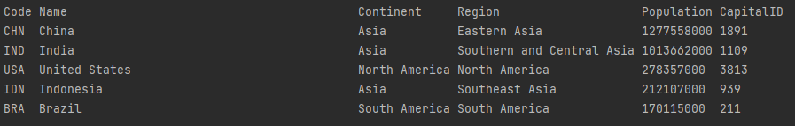
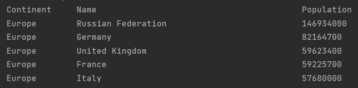
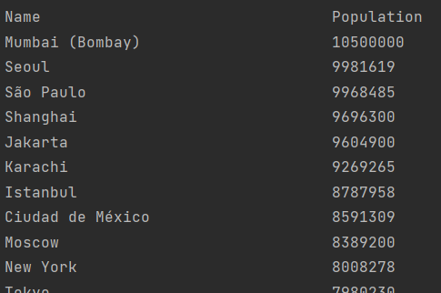
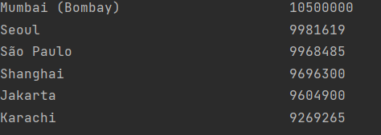
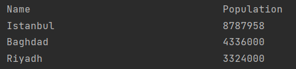
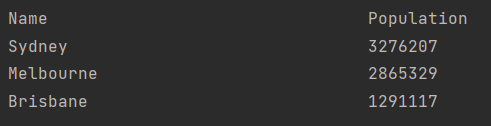
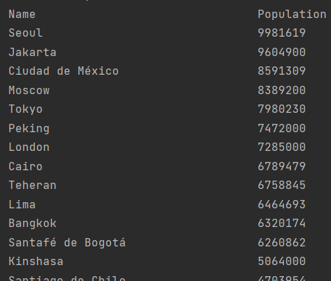
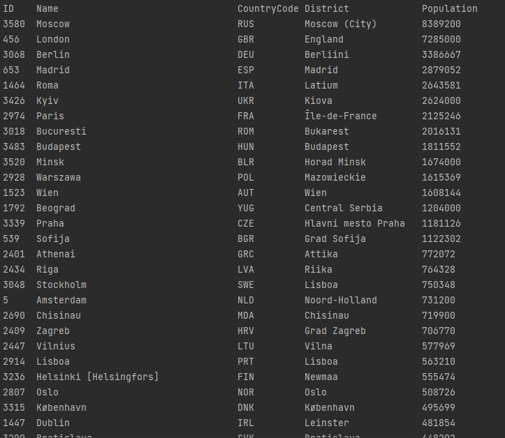

# Global population reports

An Edinburgh Napier University coursework project for Software Engineering Methods.

> 32 requirements of 32 have been implemented, which is 100%.

| ID  | Name                                                                                                                                    | Met | Example Input                                      | Output                                                                                                |
|-----|-----------------------------------------------------------------------------------------------------------------------------------------|-----|----------------------------------------------------|-------------------------------------------------------------------------------------------------------|
| 1   | All the countries in the world organised by largest population to smallest.                                                             | Yes | N/A                                                | .png)                                |
| 2   | All the countries in a continent organised by largest population to smallest.                                                           | Yes | "North America"                                    | .png)                               |
| 3   | All the countries in a region organised by largest population to smallest.                                                              | Yes | "Middle East"                                      | .png)                                  |
| 4   | The top `N` populated countries in the world where `N` is provided by the user.                                                         | Yes | 5                                                  |                                |
| 5   | The top `N` populated countries in a continent where `N` is provided by the user.                                                       | Yes | "Europe", 5                                        |                             |
| 6   | The top `N` populated countries in a region where `N` is provided by the user.                                                          | Yes | "Western Europe", 5                                | .png)                                |
| 7   | All the cities in the world organised by largest population to smallest.                                                                | Yes | N/A                                                |                                |
| 8   | All the cities in a continent organised by largest population to smallest.                                                              | Yes | "Europe"                                           | .png)             |
| 9   | All the cities in a region organised by largest population to smallest.                                                                 | Yes | "Eastern Europe"                                   | .png)         |
| 10  | All the cities in a country organised by largest population to smallest.                                                                | Yes | "France"                                           | .png)              |
| 11  | All the cities in a district organised by largest population to smallest.                                                               | Yes | "Texas", 5                                         | .png)                                  |
| 12  | The top `N` populated cities in the world where `N` is provided by the user.                                                            | Yes | 6                                                  |                                |
| 13  | The top `N` populated cities in a continent where `N` is provided by the user.                                                          | Yes | "Europe", 6                                        | .png)                    |
| 14  | The top `N` populated cities in a region where `N` is provided by the user.                                                             | Yes | "Middle East", 3                                   |                                 |
| 15  | The top `N` populated cities in a country where `N` is provided by the user.                                                            | Yes | "Australia", 3                                     |                                |
| 16  | The top `N` populated cities in a district where `N` is provided by the user.                                                           | Yes | "Texas", 5                                         | .png)                                     |
| 17  | All the capital cities in the world organised by largest population to smallest.                                                        | Yes | N/A                                                |                           |
| 18  | All the capital cities in a continent organised by largest population to smallest.                                                      | Yes | "South America"                                    |                |
| 19  | All the capital cities in a region organised by largest to smallest.                                                                    | Yes | "Western Europe"                                   | .png) |
| 20  | The top `N` populated capital cities in the world where `N` is provided by the user.                                                    | Yes | 5                                                  | .png)                                 |
| 21  | The top `N` populated capital cities in a continent where `N` is provided by the user.                                                  | Yes | "Europe", 5                                        | .png)                              |
| 22  | The top `N` populated capital cities in a region where `N` is provided by the user.                                                     | Yes | "Western Europe", 3                                | .png)                |
| 23  | The population of people, people living in cities, and people not living in cities in each continent.                                   | Yes | N/A                                                | .png)                                 |
| 24  | The population of people, people living in cities, and people not living in cities in each region.                                      | Yes | N/A                                                | .png)                                    |
| 25  | The population of people, people living in cities, and people not living in cities in each country.                                     | Yes | N/A                                                | .png)                                   |
| 26  | The population of the world.                                                                                                            | Yes | N/A                                                | .png)                                    |
| 27  | The population of a continent.                                                                                                          | Yes | "Europe"                                           | .png)                        |
| 28  | The population of a region.                                                                                                             | Yes | "Eastern Africa"                                   | .png)                    |
| 29  | The population of a country.                                                                                                            | Yes | "Hungary"                                          | .png)                         |
| 30  | The population of a district.                                                                                                           | Yes | "Gyor-Moson-Sopron"                                | .png)              |
| 31  | The population of a city.                                                                                                               | Yes | "Gyor"                                             | .png)                               |
| 32  | The number of people who speak the listed languages from greatest number to smallest, including the percentage of the world population. | Yes | "Chinese", "English", "Hindi", "Spanish", "Arabic" | .png)                                |